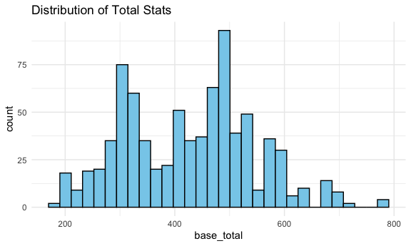
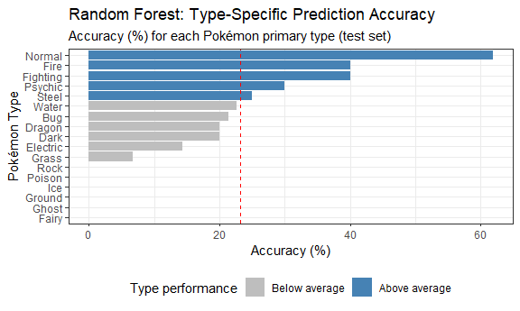

Project Working File
================
Sergio Ozoria
2025-11-26

``` r
library(tidyverse)
library(scales)
library(viridis)
library(randomForest)
library(caret)

knitr::opts_chunk$set(
  fig.width = 6,
  fig.asp = .6,
  out.width = "90%"
)

theme_set(theme_minimal() + theme(legend.position = "bottom"))

options(
  ggplot2.continuous.colour = "viridis",
  ggplot2.continuous.fill = "viridis"
)

scale_colour_discrete = scale_colour_viridis
```

``` r
#  serg - cleaning up name using snake format + concatenating missing values 
poke_tidy = read_csv("./Data/pokemon.csv", na = c("NA", ".", "")) |> 
  janitor::clean_names()

# serg - replacing missing type 2 with none
poke_tidy = poke_tidy |> 
  mutate(
    type2 = ifelse(is.na(type2), "None", type2),
    type1 = str_to_title(type1),
    type2 = str_to_title(type2)
  ) |> 
  distinct(name, .keep_all = TRUE)

# serg - cleaning up abilities (could also create variables for each)
poke_tidy = poke_tidy |> 
  mutate(
    abilities = str_remove_all(abilities, "\\[|\\]|'")
  )

# serg - in case there's missing gender 
poke_tidy = poke_tidy |> 
  mutate(
    genderless = ifelse(is.na(percentage_male), TRUE, FALSE)
  )

# serg - categorical var for plotting/modeling
poke_tidy = poke_tidy |> 
  mutate(
    type1 = factor(type1),
    type2 = factor(type2),
    generation = factor(generation),
    is_legendary = as.logical(is_legendary)
  )
```

``` r
# eman - convert  numeric columns

poke_tidy =
  poke_tidy |> 
  mutate(across(
    .cols = c(starts_with("against_"), "hp", "attack", "defense", "sp_attack", "sp_defense", "speed", "height_m", "weight_kg", "base_total"),
    .fns = as.numeric
  )) 
```

``` r
# eman - create attack/defense ratio (useful for visuals later)

poke_tidy = 
  poke_tidy |> 
  mutate(offense_defense_ratio = attack / defense)
```

``` r
# eman - starting with basic eda

head(poke_tidy)
```

    ## # A tibble: 6 × 43
    ##   abilities             against_bug against_dark against_dragon against_electric
    ##   <chr>                       <dbl>        <dbl>          <dbl>            <dbl>
    ## 1 Overgrow, Chlorophyll        1               1              1              0.5
    ## 2 Overgrow, Chlorophyll        1               1              1              0.5
    ## 3 Overgrow, Chlorophyll        1               1              1              0.5
    ## 4 Blaze, Solar Power           0.5             1              1              1  
    ## 5 Blaze, Solar Power           0.5             1              1              1  
    ## 6 Blaze, Solar Power           0.25            1              1              2  
    ## # ℹ 38 more variables: against_fairy <dbl>, against_fight <dbl>,
    ## #   against_fire <dbl>, against_flying <dbl>, against_ghost <dbl>,
    ## #   against_grass <dbl>, against_ground <dbl>, against_ice <dbl>,
    ## #   against_normal <dbl>, against_poison <dbl>, against_psychic <dbl>,
    ## #   against_rock <dbl>, against_steel <dbl>, against_water <dbl>, attack <dbl>,
    ## #   base_egg_steps <dbl>, base_happiness <dbl>, base_total <dbl>,
    ## #   capture_rate <chr>, classfication <chr>, defense <dbl>, …

``` r
ggplot(poke_tidy, aes(base_total))+
  geom_histogram(bins = 30, fill = "skyblue", color = "black")+
  labs(title = "Distribution of Total Stats")
```



## Ditstribution of Total Stats

We first looked at the overall strength of all Pokemon by plotting the
`base_total`. This helps us understand how strong mose pokemon are. The
histogram shows that mnay pokemon fall in the middle range (from 300-550
total stats). Only a few Pokemon have very high stats (above 650), which
makes sense because very strong Pokemon are rare. From this plot, we can
see that the dataset includes both weak and strong Pokremon, and it’s a
good starting point before we compare groups or run hypothesis tests.

``` r
# eman - average total stats by type

ggplot(poke_tidy, aes(type1, base_total))+
  geom_boxplot()+
  coord_flip()+
  labs(title = "Total Stats by Primary Type")
```


## Total Stats by Primary Type

We compared total stats across different Pokemon types to see if some
types are usually stronger than others. The boxplot shows clear
differences. Types like Dragon, Steel, and Psychic tend to have higher
total stats. On the other hand, Bug, Normal, and Poison types usually
have lower stats. Even though the ranges overlap, the medians are
different enough to show that type does matter.This supports our later
statistical test (ANOVA), which also found significant differences
across types.

``` r
#eman - height vs weight colored by strength

ggplot(poke_tidy, aes(height_m, weight_kg, color = base_total))+
  geom_point(alpha = 0.6, size =2)+
  scale_color_viridis_c()+
  labs(title = "Height vs Weight (Colored by total stats")
```

    ## Warning: Removed 20 rows containing missing values or values outside the scale range
    ## (`geom_point()`).


## Height vs. Weight Colored by Total Stats

To see how physical characteristics relate to strength, we plotted each
Pokemon’s height and weight and colored the points by total stats. The
plots shows that many of the heavier and taller Pokemon have higher
stats (shown by the brighter colors). Smaller Pokemon have a wide range
of stat values, meaning some are strong but many are not. This suggests
that size does play a role in strength, although it is not the only
factor. This is why we later include height and weight as covariates in
the regression model.

``` r
# eman - hypothesis testing
# test 1: ANOVA - Do types differ in strength?
# Null hypothesis: mean total stats are equal across all types

anova_type = 
  aov(base_total ~ type1, data = poke_tidy)
summary(anova_type)
```

    ##              Df   Sum Sq Mean Sq F value   Pr(>F)    
    ## type1        17   749022   44060   3.249 1.04e-05 ***
    ## Residuals   783 10618573   13561                     
    ## ---
    ## Signif. codes:  0 '***' 0.001 '**' 0.01 '*' 0.05 '.' 0.1 ' ' 1

``` r
# eman - hypothesis testing
# test 2: t-test - Are legendary Pokemon stronger?
# Null hypothesis:legendary and non-legendary pokemon have the same mean total stats

t.test(base_total ~ is_legendary, data = poke_tidy)
```

    ## 
    ##  Welch Two Sample t-test
    ## 
    ## data:  base_total by is_legendary
    ## t = -19.268, df = 92.287, p-value < 2.2e-16
    ## alternative hypothesis: true difference in means between group FALSE and group TRUE is not equal to 0
    ## 95 percent confidence interval:
    ##  -225.8825 -183.6688
    ## sample estimates:
    ## mean in group FALSE  mean in group TRUE 
    ##            410.4815            615.2571

## Compating Strength Across Types and Legendary Status

We then ran two hypothesis tests to compare Pokemon strength across
groups. First, the ANOVA showed that average total stats are different
across Pokemon types (p\<0.001). This matches what we saw in the
boxplot, where some types clearly looked stronger than others. Second,
the t-test comparing legedary vs. non-legendary Pokemon showed that
legendary Pokemon have much higher total stats. The difference was very
significant. These results tell us that both Pokemon type and legendary
status are strongly related to how strong a Pokemon is.

``` r
# eman - logistic regression (predicting legendary)

legend_model =
  glm (
    is_legendary ~ base_total + type1+ generation,
    data = poke_tidy, 
    family = "binomial"
  )
```

    ## Warning: glm.fit: fitted probabilities numerically 0 or 1 occurred

``` r
summary(legend_model)
```

    ## 
    ## Call:
    ## glm(formula = is_legendary ~ base_total + type1 + generation, 
    ##     family = "binomial", data = poke_tidy)
    ## 
    ## Coefficients:
    ##                 Estimate Std. Error z value Pr(>|z|)    
    ## (Intercept)   -2.239e+01  2.767e+00  -8.093 5.80e-16 ***
    ## base_total     3.386e-02  4.245e-03   7.976 1.51e-15 ***
    ## type1Dark      2.736e-01  1.168e+00   0.234  0.81480    
    ## type1Dragon   -1.397e+00  1.141e+00  -1.224  0.22090    
    ## type1Electric  1.536e+00  1.029e+00   1.492  0.13558    
    ## type1Fairy    -2.487e-01  1.858e+00  -0.134  0.89348    
    ## type1Fighting -1.605e+01  1.541e+03  -0.010  0.99169    
    ## type1Fire      8.577e-01  9.762e-01   0.879  0.37959    
    ## type1Flying    2.076e+00  1.974e+00   1.052  0.29287    
    ## type1Ghost    -9.687e-01  1.696e+00  -0.571  0.56777    
    ## type1Grass     1.447e-01  9.941e-01   0.146  0.88430    
    ## type1Ground    1.941e-01  1.421e+00   0.137  0.89134    
    ## type1Ice       1.620e+00  1.154e+00   1.404  0.16046    
    ## type1Normal   -1.120e+00  1.130e+00  -0.991  0.32173    
    ## type1Poison   -1.449e+01  1.542e+03  -0.009  0.99250    
    ## type1Psychic   2.636e+00  9.705e-01   2.716  0.00661 ** 
    ## type1Rock      2.770e-01  1.100e+00   0.252  0.80121    
    ## type1Steel     1.142e+00  1.110e+00   1.029  0.30325    
    ## type1Water    -1.926e-01  9.945e-01  -0.194  0.84642    
    ## generation2    4.391e-01  9.427e-01   0.466  0.64134    
    ## generation3   -1.655e-03  8.533e-01  -0.002  0.99845    
    ## generation4    1.357e+00  7.983e-01   1.700  0.08918 .  
    ## generation5    2.057e+00  7.919e-01   2.598  0.00938 ** 
    ## generation6    8.270e-01  1.026e+00   0.806  0.42014    
    ## generation7    3.563e+00  8.468e-01   4.208 2.58e-05 ***
    ## ---
    ## Signif. codes:  0 '***' 0.001 '**' 0.01 '*' 0.05 '.' 0.1 ' ' 1
    ## 
    ## (Dispersion parameter for binomial family taken to be 1)
    ## 
    ##     Null deviance: 474.93  on 800  degrees of freedom
    ## Residual deviance: 177.25  on 776  degrees of freedom
    ## AIC: 227.25
    ## 
    ## Number of Fisher Scoring iterations: 18

``` r
poke_tidy$predicted_legendary =
  predict(legend_model, type = "response")
```

## Logistic Regression: Predicting Legendary Pokemon

We ran a logistic regression to see whether we could predict if a
Pokemon is legendary based on its total stats, type, and generation.
This model helps us understand which characteristics are most strongly
linked with legendary status. The results show that `base_total` is the
strongest and most important predictor. As total stats increase, the
probability of being legendary also increases. This makes sense, because
legendary Pokemon are designed to be much stronger than regular Pokemon.
Most of the type variables were not significant, meaning that a
Pokemon’s type does not strongly determine whether it is legendary after
we account for total stats. A few generations showed small effects, but
these were not as strong as the effect of base_total. Overall, the model
supports what we expected: Stronger Pokemon are far more likely to be
legendary, and total stats explain more of this difference.

``` r
#eman - saving clean dataset

write_csv(poke_tidy, "Data/pokemon_clean.csv")
```

``` r
#maria - Hypothesis testing

# Can we predict Pokémon type from stats?

poke_type <- poke_tidy |> 
  select(type1, hp, attack, defense, sp_attack, sp_defense, speed) |> 
  mutate(type1 = as.factor(type1))

# 80/20 train-test split
set.seed(123)

train_index <- createDataPartition(poke_type[["type1"]], 
                                   p = 0.8, list = FALSE)

train_set <- poke_type[train_index, ]
test_set  <- poke_type[-train_index, ]

# Train Random Forest
type_model = randomForest(type1 ~ ., data = train_set, ntree = 500)

# Make predictions
predictions = predict(type_model, newdata = test_set)

# Accuracy
accuracy = mean(predictions == test_set[[1]])
baseline = 1/18
improvement = accuracy - baseline

# Results
results = list(
  Accuracy = round(accuracy * 100, 1),
  Baseline = round(100/18, 1),
  Improvement = round((accuracy - (1/18)) * 100, 1)
)

results
```

    ## $Accuracy
    ## [1] 23.2
    ## 
    ## $Baseline
    ## [1] 5.6
    ## 
    ## $Improvement
    ## [1] 17.6

``` r
# Feature importance
importance_scores = importance(type_model)
varImpPlot(type_model, main = "Feature Importance for Type Prediction")
```


``` r
# Type-specific accuracy
conf_matrix = table(test_set[["type1"]], predictions)

type_accuracy = diag(conf_matrix) / rowSums(conf_matrix)

type_accuracy_df <- data.frame(
  Type = names(type_accuracy),
  Accuracy = round(type_accuracy * 100, 1)
) |> 
  arrange(desc(Accuracy)) |> 
  na.omit()


# Visualization for Prediction Accuracy
ggplot(type_accuracy_df, 
       aes(x = reorder(Type, Accuracy), 
           y = Accuracy)) +
  geom_col(aes(fill = Accuracy > 23.2)) +
  geom_hline(yintercept = 23.2, linetype = "dashed", color = "red") + 
  coord_flip() +
  scale_fill_manual(
    values = c("TRUE" = "steelblue", "FALSE" = "gray"),
    labels = c("Below average", "Above average"),
    name = "Type performance"
  ) +
  labs(
    title = "Random Forest: Type-Specific Prediction Accuracy",
    subtitle = "Accuracy (%) for each Pokémon primary type (test set)",
    x = "Pokémon Type",
    y = "Accuracy (%)"
  ) +
  theme_bw()+
theme(legend.position = "bottom")
```



The Random Forest model achieved 23.2% accuracy in predicting Pokémon
primary type from base stats alone—4.1 times better than the 5.6%
baseline expected from random guessing across 18 types. This represents
a 17.6 percentage-point improvement and narrowly approaches our 25%
stretch target, demonstrating that Pokémon stats do contain meaningful
type-specific patterns.

Types with 0% accuracy likely had very small sample sizes in the test
set (1-2 Pokémon), making them vulnerable to misclassification. This
highlights a limitation of our dataset size for rare type categories.

Surprisingly, Normal type was most predictable (61.9%), possibly because
its balanced, middle-range stat profile is distinctive compared to the
more specialized distributions of other types.

## HYPOTHESIS TEST CONCLUSION:

We REJECT the null hypothesis (H₀). The model’s performance exceeds
baseline, providing evidence that Pokémon primary types differ
systematically in their stat distributions.

Variable importance analysis reveals that Special Attack, Attack and
Speed are the strongest type predictors. This suggests offensive
capabilities and speed tiers are more type-distinctive than defensive
stats—consistent with Pokémon battle mechanics where types often
specialize in offensive roles (e.g., Fighting types favor high Attack,
Psychic types favor Special Attack).

Type-specific accuracy varied substantially. The easiest types to
predict were Normal (61.9%), Fighting (40%), and Fire (40%), likely
because these types have distinctive stat profiles. In contrast, several
types such as Fairy, Ghost, Ground, Ice, Poison, and Rock had 0%
accuracy, reflecting high overlap in stat distributions with other
types. This explains why the overall model accuracy (~23%) is moderate,
many Pokémon share similar stats despite different types.

From a gameplay perspective, base stats provide useful but incomplete
information about type identity. Players should consider both stat
distributions and type matchups when building balanced teams.

## Capture Rate vs Performance Analysis

``` r
# Serg - Hypothesis testing using linear regression
# RQ: Is there a relationship between capture rate and overall combat effectiveness?


capture_stats <- poke_tidy |>
  mutate(
    capture_rate    = as.numeric(capture_rate),
    percentage_male = as.numeric(percentage_male),
    generation_grp  = case_when(
      generation %in% c("1","2","3") ~ "Early",
      generation %in% c("4","5","6","7") ~ "Modern",
      TRUE ~ NA_character_
    )
  ) |>
  mutate(
    generation_grp = factor(generation_grp, levels = c("Early", "Modern"))
  ) |>
  filter(
    is_legendary == FALSE,
    !is.na(capture_rate),
    !is.na(base_total),
    !is.na(height_m),
    !is.na(weight_kg),
    !is.na(percentage_male),
    !is.na(generation_grp)
  )

# Run linear regression
capture_stats_lm <- lm(
  base_total ~ capture_rate + height_m + 
    weight_kg + percentage_male + generation_grp,
  data = capture_stats
)

summary(capture_stats_lm)
```

    ## 
    ## Call:
    ## lm(formula = base_total ~ capture_rate + height_m + weight_kg + 
    ##     percentage_male + generation_grp, data = capture_stats)
    ## 
    ## Residuals:
    ##      Min       1Q   Median       3Q      Max 
    ## -309.936  -36.895    3.166   37.754  258.690 
    ## 
    ## Coefficients:
    ##                       Estimate Std. Error t value Pr(>|t|)    
    ## (Intercept)          482.90684   11.99129  40.271  < 2e-16 ***
    ## capture_rate          -0.85462    0.04146 -20.615  < 2e-16 ***
    ## height_m              20.55383    3.81794   5.383 1.01e-07 ***
    ## weight_kg              0.24705    0.04892   5.050 5.70e-07 ***
    ## percentage_male       -0.36099    0.14029  -2.573   0.0103 *  
    ## generation_grpModern   9.11267    5.50052   1.657   0.0980 .  
    ## ---
    ## Signif. codes:  0 '***' 0.001 '**' 0.01 '*' 0.05 '.' 0.1 ' ' 1
    ## 
    ## Residual standard error: 70.58 on 671 degrees of freedom
    ## Multiple R-squared:  0.5629, Adjusted R-squared:  0.5596 
    ## F-statistic: 172.8 on 5 and 671 DF,  p-value: < 2.2e-16

``` r
coef_table <- summary(capture_stats_lm)$coefficients |>
  as.data.frame() |>
  tibble::rownames_to_column("Predictor")

knitr::kable(
  coef_table,
  digits = 3,
  caption = "Regression: Capture Rate Predicting Total Base Stats"
)
```

| Predictor            | Estimate | Std. Error | t value | Pr(\>\|t\|) |
|:---------------------|---------:|-----------:|--------:|------------:|
| (Intercept)          |  482.907 |     11.991 |  40.271 |       0.000 |
| capture_rate         |   -0.855 |      0.041 | -20.615 |       0.000 |
| height_m             |   20.554 |      3.818 |   5.383 |       0.000 |
| weight_kg            |    0.247 |      0.049 |   5.050 |       0.000 |
| percentage_male      |   -0.361 |      0.140 |  -2.573 |       0.010 |
| generation_grpModern |    9.113 |      5.501 |   1.657 |       0.098 |

Regression: Capture Rate Predicting Total Base Stats

``` r
# Serg - Hypothesis testing using linear regression
  # RQ: Is there a relationship between capture rate and overall combat effectiveness?

# serg - selecting analytic sample + covariates

library(gtsummary)
library(sjPlot)

capture_stats <- poke_tidy |>
  mutate(
    capture_rate = as.numeric(capture_rate),
    percentage_male = as.numeric(percentage_male),
    
    generation = factor(
      case_when(
        generation %in% c("1","2","3") ~ "Early",
        generation %in% c("4","5","6","7") ~ "Modern"
      ),
      levels = c("Early", "Modern")
    )
  ) |>
  filter(
    is_legendary == FALSE,
    if_all(c(capture_rate, base_total, height_m,
             percentage_male, weight_kg, generation), ~ !is.na(.x))
  )
```

    ## Warning: There was 1 warning in `mutate()`.
    ## ℹ In argument: `capture_rate = as.numeric(capture_rate)`.
    ## Caused by warning:
    ## ! NAs introduced by coercion

``` r
# running linear regression model

capture_stats_lm = lm(
  base_total ~ capture_rate + height_m + 
    weight_kg + percentage_male + generation,
  data = capture_stats
)

summary(capture_stats_lm)
```

    ## 
    ## Call:
    ## lm(formula = base_total ~ capture_rate + height_m + weight_kg + 
    ##     percentage_male + generation, data = capture_stats)
    ## 
    ## Residuals:
    ##      Min       1Q   Median       3Q      Max 
    ## -309.936  -36.895    3.166   37.754  258.690 
    ## 
    ## Coefficients:
    ##                   Estimate Std. Error t value Pr(>|t|)    
    ## (Intercept)      482.90684   11.99129  40.271  < 2e-16 ***
    ## capture_rate      -0.85462    0.04146 -20.615  < 2e-16 ***
    ## height_m          20.55383    3.81794   5.383 1.01e-07 ***
    ## weight_kg          0.24705    0.04892   5.050 5.70e-07 ***
    ## percentage_male   -0.36099    0.14029  -2.573   0.0103 *  
    ## generationModern   9.11267    5.50052   1.657   0.0980 .  
    ## ---
    ## Signif. codes:  0 '***' 0.001 '**' 0.01 '*' 0.05 '.' 0.1 ' ' 1
    ## 
    ## Residual standard error: 70.58 on 671 degrees of freedom
    ## Multiple R-squared:  0.5629, Adjusted R-squared:  0.5596 
    ## F-statistic: 172.8 on 5 and 671 DF,  p-value: < 2.2e-16

``` r
tbl_regression(
  capture_stats_lm,
  intercept = TRUE,
  estimate_fun = ~ style_number(.x, digits = 2),
  pvalue_fun = ~ style_pvalue(.x),
  label = list(
    capture_rate ~ "Capture Rate",
    height_m ~ "Height (m)",
    weight_kg ~ "Weight (kg)",
    percentage_male ~ "Percentage Male",
    generation ~ "Generation (ref = Early)"
  )
) |> 
  modify_header(label = "**Predictors**")
```

<div id="rvgozboszc" style="padding-left:0px;padding-right:0px;padding-top:10px;padding-bottom:10px;overflow-x:auto;overflow-y:auto;width:auto;height:auto;">
<style>#rvgozboszc table {
  font-family: system-ui, 'Segoe UI', Roboto, Helvetica, Arial, sans-serif, 'Apple Color Emoji', 'Segoe UI Emoji', 'Segoe UI Symbol', 'Noto Color Emoji';
  -webkit-font-smoothing: antialiased;
  -moz-osx-font-smoothing: grayscale;
}
&#10;#rvgozboszc thead, #rvgozboszc tbody, #rvgozboszc tfoot, #rvgozboszc tr, #rvgozboszc td, #rvgozboszc th {
  border-style: none;
}
&#10;#rvgozboszc p {
  margin: 0;
  padding: 0;
}
&#10;#rvgozboszc .gt_table {
  display: table;
  border-collapse: collapse;
  line-height: normal;
  margin-left: auto;
  margin-right: auto;
  color: #333333;
  font-size: 16px;
  font-weight: normal;
  font-style: normal;
  background-color: #FFFFFF;
  width: auto;
  border-top-style: solid;
  border-top-width: 2px;
  border-top-color: #A8A8A8;
  border-right-style: none;
  border-right-width: 2px;
  border-right-color: #D3D3D3;
  border-bottom-style: solid;
  border-bottom-width: 2px;
  border-bottom-color: #A8A8A8;
  border-left-style: none;
  border-left-width: 2px;
  border-left-color: #D3D3D3;
}
&#10;#rvgozboszc .gt_caption {
  padding-top: 4px;
  padding-bottom: 4px;
}
&#10;#rvgozboszc .gt_title {
  color: #333333;
  font-size: 125%;
  font-weight: initial;
  padding-top: 4px;
  padding-bottom: 4px;
  padding-left: 5px;
  padding-right: 5px;
  border-bottom-color: #FFFFFF;
  border-bottom-width: 0;
}
&#10;#rvgozboszc .gt_subtitle {
  color: #333333;
  font-size: 85%;
  font-weight: initial;
  padding-top: 3px;
  padding-bottom: 5px;
  padding-left: 5px;
  padding-right: 5px;
  border-top-color: #FFFFFF;
  border-top-width: 0;
}
&#10;#rvgozboszc .gt_heading {
  background-color: #FFFFFF;
  text-align: center;
  border-bottom-color: #FFFFFF;
  border-left-style: none;
  border-left-width: 1px;
  border-left-color: #D3D3D3;
  border-right-style: none;
  border-right-width: 1px;
  border-right-color: #D3D3D3;
}
&#10;#rvgozboszc .gt_bottom_border {
  border-bottom-style: solid;
  border-bottom-width: 2px;
  border-bottom-color: #D3D3D3;
}
&#10;#rvgozboszc .gt_col_headings {
  border-top-style: solid;
  border-top-width: 2px;
  border-top-color: #D3D3D3;
  border-bottom-style: solid;
  border-bottom-width: 2px;
  border-bottom-color: #D3D3D3;
  border-left-style: none;
  border-left-width: 1px;
  border-left-color: #D3D3D3;
  border-right-style: none;
  border-right-width: 1px;
  border-right-color: #D3D3D3;
}
&#10;#rvgozboszc .gt_col_heading {
  color: #333333;
  background-color: #FFFFFF;
  font-size: 100%;
  font-weight: normal;
  text-transform: inherit;
  border-left-style: none;
  border-left-width: 1px;
  border-left-color: #D3D3D3;
  border-right-style: none;
  border-right-width: 1px;
  border-right-color: #D3D3D3;
  vertical-align: bottom;
  padding-top: 5px;
  padding-bottom: 6px;
  padding-left: 5px;
  padding-right: 5px;
  overflow-x: hidden;
}
&#10;#rvgozboszc .gt_column_spanner_outer {
  color: #333333;
  background-color: #FFFFFF;
  font-size: 100%;
  font-weight: normal;
  text-transform: inherit;
  padding-top: 0;
  padding-bottom: 0;
  padding-left: 4px;
  padding-right: 4px;
}
&#10;#rvgozboszc .gt_column_spanner_outer:first-child {
  padding-left: 0;
}
&#10;#rvgozboszc .gt_column_spanner_outer:last-child {
  padding-right: 0;
}
&#10;#rvgozboszc .gt_column_spanner {
  border-bottom-style: solid;
  border-bottom-width: 2px;
  border-bottom-color: #D3D3D3;
  vertical-align: bottom;
  padding-top: 5px;
  padding-bottom: 5px;
  overflow-x: hidden;
  display: inline-block;
  width: 100%;
}
&#10;#rvgozboszc .gt_spanner_row {
  border-bottom-style: hidden;
}
&#10;#rvgozboszc .gt_group_heading {
  padding-top: 8px;
  padding-bottom: 8px;
  padding-left: 5px;
  padding-right: 5px;
  color: #333333;
  background-color: #FFFFFF;
  font-size: 100%;
  font-weight: initial;
  text-transform: inherit;
  border-top-style: solid;
  border-top-width: 2px;
  border-top-color: #D3D3D3;
  border-bottom-style: solid;
  border-bottom-width: 2px;
  border-bottom-color: #D3D3D3;
  border-left-style: none;
  border-left-width: 1px;
  border-left-color: #D3D3D3;
  border-right-style: none;
  border-right-width: 1px;
  border-right-color: #D3D3D3;
  vertical-align: middle;
  text-align: left;
}
&#10;#rvgozboszc .gt_empty_group_heading {
  padding: 0.5px;
  color: #333333;
  background-color: #FFFFFF;
  font-size: 100%;
  font-weight: initial;
  border-top-style: solid;
  border-top-width: 2px;
  border-top-color: #D3D3D3;
  border-bottom-style: solid;
  border-bottom-width: 2px;
  border-bottom-color: #D3D3D3;
  vertical-align: middle;
}
&#10;#rvgozboszc .gt_from_md > :first-child {
  margin-top: 0;
}
&#10;#rvgozboszc .gt_from_md > :last-child {
  margin-bottom: 0;
}
&#10;#rvgozboszc .gt_row {
  padding-top: 8px;
  padding-bottom: 8px;
  padding-left: 5px;
  padding-right: 5px;
  margin: 10px;
  border-top-style: solid;
  border-top-width: 1px;
  border-top-color: #D3D3D3;
  border-left-style: none;
  border-left-width: 1px;
  border-left-color: #D3D3D3;
  border-right-style: none;
  border-right-width: 1px;
  border-right-color: #D3D3D3;
  vertical-align: middle;
  overflow-x: hidden;
}
&#10;#rvgozboszc .gt_stub {
  color: #333333;
  background-color: #FFFFFF;
  font-size: 100%;
  font-weight: initial;
  text-transform: inherit;
  border-right-style: solid;
  border-right-width: 2px;
  border-right-color: #D3D3D3;
  padding-left: 5px;
  padding-right: 5px;
}
&#10;#rvgozboszc .gt_stub_row_group {
  color: #333333;
  background-color: #FFFFFF;
  font-size: 100%;
  font-weight: initial;
  text-transform: inherit;
  border-right-style: solid;
  border-right-width: 2px;
  border-right-color: #D3D3D3;
  padding-left: 5px;
  padding-right: 5px;
  vertical-align: top;
}
&#10;#rvgozboszc .gt_row_group_first td {
  border-top-width: 2px;
}
&#10;#rvgozboszc .gt_row_group_first th {
  border-top-width: 2px;
}
&#10;#rvgozboszc .gt_summary_row {
  color: #333333;
  background-color: #FFFFFF;
  text-transform: inherit;
  padding-top: 8px;
  padding-bottom: 8px;
  padding-left: 5px;
  padding-right: 5px;
}
&#10;#rvgozboszc .gt_first_summary_row {
  border-top-style: solid;
  border-top-color: #D3D3D3;
}
&#10;#rvgozboszc .gt_first_summary_row.thick {
  border-top-width: 2px;
}
&#10;#rvgozboszc .gt_last_summary_row {
  padding-top: 8px;
  padding-bottom: 8px;
  padding-left: 5px;
  padding-right: 5px;
  border-bottom-style: solid;
  border-bottom-width: 2px;
  border-bottom-color: #D3D3D3;
}
&#10;#rvgozboszc .gt_grand_summary_row {
  color: #333333;
  background-color: #FFFFFF;
  text-transform: inherit;
  padding-top: 8px;
  padding-bottom: 8px;
  padding-left: 5px;
  padding-right: 5px;
}
&#10;#rvgozboszc .gt_first_grand_summary_row {
  padding-top: 8px;
  padding-bottom: 8px;
  padding-left: 5px;
  padding-right: 5px;
  border-top-style: double;
  border-top-width: 6px;
  border-top-color: #D3D3D3;
}
&#10;#rvgozboszc .gt_last_grand_summary_row_top {
  padding-top: 8px;
  padding-bottom: 8px;
  padding-left: 5px;
  padding-right: 5px;
  border-bottom-style: double;
  border-bottom-width: 6px;
  border-bottom-color: #D3D3D3;
}
&#10;#rvgozboszc .gt_striped {
  background-color: rgba(128, 128, 128, 0.05);
}
&#10;#rvgozboszc .gt_table_body {
  border-top-style: solid;
  border-top-width: 2px;
  border-top-color: #D3D3D3;
  border-bottom-style: solid;
  border-bottom-width: 2px;
  border-bottom-color: #D3D3D3;
}
&#10;#rvgozboszc .gt_footnotes {
  color: #333333;
  background-color: #FFFFFF;
  border-bottom-style: none;
  border-bottom-width: 2px;
  border-bottom-color: #D3D3D3;
  border-left-style: none;
  border-left-width: 2px;
  border-left-color: #D3D3D3;
  border-right-style: none;
  border-right-width: 2px;
  border-right-color: #D3D3D3;
}
&#10;#rvgozboszc .gt_footnote {
  margin: 0px;
  font-size: 90%;
  padding-top: 4px;
  padding-bottom: 4px;
  padding-left: 5px;
  padding-right: 5px;
}
&#10;#rvgozboszc .gt_sourcenotes {
  color: #333333;
  background-color: #FFFFFF;
  border-bottom-style: none;
  border-bottom-width: 2px;
  border-bottom-color: #D3D3D3;
  border-left-style: none;
  border-left-width: 2px;
  border-left-color: #D3D3D3;
  border-right-style: none;
  border-right-width: 2px;
  border-right-color: #D3D3D3;
}
&#10;#rvgozboszc .gt_sourcenote {
  font-size: 90%;
  padding-top: 4px;
  padding-bottom: 4px;
  padding-left: 5px;
  padding-right: 5px;
}
&#10;#rvgozboszc .gt_left {
  text-align: left;
}
&#10;#rvgozboszc .gt_center {
  text-align: center;
}
&#10;#rvgozboszc .gt_right {
  text-align: right;
  font-variant-numeric: tabular-nums;
}
&#10;#rvgozboszc .gt_font_normal {
  font-weight: normal;
}
&#10;#rvgozboszc .gt_font_bold {
  font-weight: bold;
}
&#10;#rvgozboszc .gt_font_italic {
  font-style: italic;
}
&#10;#rvgozboszc .gt_super {
  font-size: 65%;
}
&#10;#rvgozboszc .gt_footnote_marks {
  font-size: 75%;
  vertical-align: 0.4em;
  position: initial;
}
&#10;#rvgozboszc .gt_asterisk {
  font-size: 100%;
  vertical-align: 0;
}
&#10;#rvgozboszc .gt_indent_1 {
  text-indent: 5px;
}
&#10;#rvgozboszc .gt_indent_2 {
  text-indent: 10px;
}
&#10;#rvgozboszc .gt_indent_3 {
  text-indent: 15px;
}
&#10;#rvgozboszc .gt_indent_4 {
  text-indent: 20px;
}
&#10;#rvgozboszc .gt_indent_5 {
  text-indent: 25px;
}
&#10;#rvgozboszc .katex-display {
  display: inline-flex !important;
  margin-bottom: 0.75em !important;
}
&#10;#rvgozboszc div.Reactable > div.rt-table > div.rt-thead > div.rt-tr.rt-tr-group-header > div.rt-th-group:after {
  height: 0px !important;
}
</style>
<table class="gt_table" data-quarto-disable-processing="false" data-quarto-bootstrap="false">
  <thead>
    <tr class="gt_col_headings">
      <th class="gt_col_heading gt_columns_bottom_border gt_left" rowspan="1" colspan="1" scope="col" id="label"><span class='gt_from_md'><strong>Predictors</strong></span></th>
      <th class="gt_col_heading gt_columns_bottom_border gt_center" rowspan="1" colspan="1" scope="col" id="estimate"><span class='gt_from_md'><strong>Beta</strong></span></th>
      <th class="gt_col_heading gt_columns_bottom_border gt_center" rowspan="1" colspan="1" scope="col" id="conf.low"><span class='gt_from_md'><strong>95% CI</strong></span></th>
      <th class="gt_col_heading gt_columns_bottom_border gt_center" rowspan="1" colspan="1" scope="col" id="p.value"><span class='gt_from_md'><strong>p-value</strong></span></th>
    </tr>
  </thead>
  <tbody class="gt_table_body">
    <tr><td headers="label" class="gt_row gt_left">(Intercept)</td>
<td headers="estimate" class="gt_row gt_center">482.91</td>
<td headers="conf.low" class="gt_row gt_center">459.36, 506.45</td>
<td headers="p.value" class="gt_row gt_center"><0.001</td></tr>
    <tr><td headers="label" class="gt_row gt_left">Capture Rate</td>
<td headers="estimate" class="gt_row gt_center">-0.85</td>
<td headers="conf.low" class="gt_row gt_center">-0.94, -0.77</td>
<td headers="p.value" class="gt_row gt_center"><0.001</td></tr>
    <tr><td headers="label" class="gt_row gt_left">Height (m)</td>
<td headers="estimate" class="gt_row gt_center">20.55</td>
<td headers="conf.low" class="gt_row gt_center">13.06, 28.05</td>
<td headers="p.value" class="gt_row gt_center"><0.001</td></tr>
    <tr><td headers="label" class="gt_row gt_left">Weight (kg)</td>
<td headers="estimate" class="gt_row gt_center">0.25</td>
<td headers="conf.low" class="gt_row gt_center">0.15, 0.34</td>
<td headers="p.value" class="gt_row gt_center"><0.001</td></tr>
    <tr><td headers="label" class="gt_row gt_left">Percentage Male</td>
<td headers="estimate" class="gt_row gt_center">-0.36</td>
<td headers="conf.low" class="gt_row gt_center">-0.64, -0.09</td>
<td headers="p.value" class="gt_row gt_center">0.010</td></tr>
    <tr><td headers="label" class="gt_row gt_left">Generation (ref = Early)</td>
<td headers="estimate" class="gt_row gt_center"><br /></td>
<td headers="conf.low" class="gt_row gt_center"><br /></td>
<td headers="p.value" class="gt_row gt_center"><br /></td></tr>
    <tr><td headers="label" class="gt_row gt_left">    Early</td>
<td headers="estimate" class="gt_row gt_center">—</td>
<td headers="conf.low" class="gt_row gt_center">—</td>
<td headers="p.value" class="gt_row gt_center"><br /></td></tr>
    <tr><td headers="label" class="gt_row gt_left">    Modern</td>
<td headers="estimate" class="gt_row gt_center">9.11</td>
<td headers="conf.low" class="gt_row gt_center">-1.69, 19.91</td>
<td headers="p.value" class="gt_row gt_center">0.10</td></tr>
  </tbody>
  <tfoot>
    <tr class="gt_sourcenotes">
      <td class="gt_sourcenote" colspan="4"><span class='gt_from_md'>Abbreviation: CI = Confidence Interval</span></td>
    </tr>
  </tfoot>
</table>
</div>

#### Hypotheses

As Pokémon data nerds, we were interested in examining whether a
Pokemon’s capture rate is related to its overall combat potential, which
is relevant information for casual Pokémon players and competitive
trainers. Thus, we examined whether Pokémon that are harder to catch
tend to have higher base stat totals.

Our conceptual hypothesis is that performance contributes to capture
difficulty, meaning that stronger Pokémon are designed to be more
challenging to catch. To evaluate this relationship, we tested the
following hypotheses:

- H₀: There is no linear relationship between `capture_rate` and
  `base_total` among non-legendary Pokémon, after accounting for key
  demographic variables

- H₁: There is a significant negative relationship between
  `capture_rate` and `base_total` (harder-to-catch Pokémon tend to be
  stronger), after accounting for key demographic variables

#### Measures

- Exposure (predictor):`capture_rate` represents how easy a Pokémon can
  be caught, meaning that higher values = easier to catch. This variable
  was cleaned and recoded as a numeric, continuous variable to correctly
  model the linear relationship and test our hypothesis.

- Outcome (dependent): `base_total` is the sum of a Pokemon’s six base
  total stats, including `hp`, `attack`, `defense`, `sp_attack`,
  `sp_defense`, and `speed`. This variable will serve as a proxy to
  assess overall combat effectiveness.

#### Covariates

Several species-characteristics were included as covariates in the
linear regression model to address potential confounding and improve
model precision. These variables were chosen based on their plausible
relationships with both `capture_rate` (main predictor) and `base_total`
(main outcome of interest), as well as their relevancy to the universe
design and any other factors that could bias our results. These
covariates included:

- `height_m`: This represents the physical size of the Pokémon. This
  variable was selected as a covariate because larger species could
  exhibit higher base stats and may have lower capture rates, making
  height a potential confounder.
- `weight_kg`: This represents the body mass index of the Pokémon. This
  variable was selected as a covariate because heavier Pokémon could
  have higher combat stats, as well as influence catch rate difficulty.
- `percentage_male`: This represents the proportion of male species in
  the dataset.Some species may have sex-based differences when it comes
  to stats, so sex distribution could correlate with combat potential.
  This variable also helps account for any sex/gender related
  differences.
- `generation`: This represents the generation in which the Pokémon was
  first introduced. This variable was accounted for, as adjusting for it
  could control for systematic differences across generations due to
  temporal decision-making around stats or design based on generation.
  This variable was re-coded as a binary variable to capture
  contemporary differences across two chunks of Pokémon generations,
  where **Early** represents gens 1, 2, and 3, whereas **Modern**
  represents gens 4, 5, 6, and 7.

Altogether, these covariates are meant to adjust for any potential
differences across species, reduce biased estimates, and isolate the
association between capture rate and overall base stats to assess combat
effectiveness.

#### Interpretation of regression analysis

Among all non-legendary Pokémon included our cross-generational dataset
of the Pokémon universe, we observed a significant negative association
between `capture_rate` and `base_total`. More specifically, for every
one-unit increase in `capture_rate`, meaning easier to catch,
`base_total` decreased by about 0.87 points **(β = −0.87, 95% CI: −0.96,
−0.79; p \< 0.001)**. These results suggest that species designed to be
harder to catch tend to possess higher combat power than those who are
easier to catch.

At the 5% significance level, the association between `capture_rate` and
`base_total` is statistically significant, after adjusting for
`height_m`, `weight_kg`, `percentage_male`, and `generation`. Therefore,
we reject the null hypothesis that there is no linear relationship
between the exposure and outcome of interest.

## A Two-Sample T-Test of Dual-Type vs Single-Type Pokémons

``` r
# serg - running two sample t test to explore whether dual-type pokemon have statistical advantages over single-type ones
poke_2tt = poke_tidy |> 
  mutate(
    type2 = str_to_title(type2),
    dual_type = if_else(type2 == "None", "Single", "Dual")
  )

tt_result = t.test(
  base_total ~ dual_type,
  data = poke_2tt,
  var.equal = FALSE
)

tt_result
```

    ## 
    ##  Welch Two Sample t-test
    ## 
    ## data:  base_total by dual_type
    ## t = 4.388, df = 796.49, p-value = 1.298e-05
    ## alternative hypothesis: true difference in means between group Dual and group Single is not equal to 0
    ## 95 percent confidence interval:
    ##  20.19406 52.88657
    ## sample estimates:
    ##   mean in group Dual mean in group Single 
    ##             445.8945             409.3542

``` r
poke_2tt |> 
  group_by(dual_type) |> 
  summarise(
    n = n(),
    mean_stat = mean(base_total, na.rm = TRUE),
    sd_stat = sd(base_total, na.rm = TRUE)
  )
```

    ## # A tibble: 2 × 4
    ##   dual_type     n mean_stat sd_stat
    ##   <chr>     <int>     <dbl>   <dbl>
    ## 1 Dual        417      446.    119.
    ## 2 Single      384      409.    116.

``` r
ggplot(poke_2tt, aes(x = dual_type, y = base_total, fill = dual_type)) +
  geom_violin(trim = FALSE) +
  geom_boxplot(width = 0.2, alpha = 0.5) +
  labs(
    x = "Pokémon Typing",
    y = "Total Base Stats",
    title = "Single-Type vs Dual-Type Pokémon: Total Stats Comparison"
  )
```


#### Hypotheses

We next examined whether dual-type Pokémon have a statistical advantage
over single type Pokémon in terms of overall combat strengthe. More
specifically, we wanted to test whether the total base stats differ
between single_type and dual-type Pokémons.

The following analysis will explore these hypotheses:

- H₀: There is no difference in mean `base_total` between single-type
  and dual-type Pokémon

- H₁: There is a difference in mean `base_total` between single-type and
  dual-type Pokémon

#### Measures

We first created a binary type variable (i.e., `dual_type`), where we
recoded observations as **Single** for Pokémon with only a primary type
(i.e., `type2 == "None"`) and **Dual** for those with both primary and
secondary types. Our outcome variable, `base_total`, represents the sum
of each Pokemon’s six base stats, including `hp`, `attack`, `defense`,
`sp_attack`, `sp_defense`, and `speed`, which will serve as a proxy to
measure overall combat potential.

To compare mean `base_total` between single type and dual type species,
we used a two-sample t-test, which allows for unequal variances, with
`base_total` as the continuous outcome and `dual_typ` as the grouping
variable. We also plotted the distribution of total stats using violin
and boxplots to assess overlap and spread between both groups.

#### Results

On average, Dual-type Pokémon had higher total base stats than
single-type Pokémon, as evidenced by a mean of 445.9 compared to 409.9.
The difference of about 36.5 points higher tell us there results were
statistically significant, as noted below:

- t = 4.39
- df = 796.5
- p = 1.30 × 10^5
- 95% CI: 20.2 to 52.9

Given these results and because the confidence interval does not include
the value of zero and the p-value is far below 0.05%, we reject the null
hypothesis that there are no mean differences between single-type and
dual-type Pokémons. These results show that dual-type species tend to
have higher base total stats than those with only one type.

#### Violin + Boxplot Interpretation & Conclusions

To visualize the distribution of total base stats between dual-type and
single-type Pokémons, **a violin, box-plot was created**. As noted on
the plot, we see that the distribution for dual-type Pokémons shifted
upwards, indicating higher median and a denser cluster of higher-stat
Pokémon than those with a single-type. Both groups, however, do show
variability, with dual-type Pokémon dominating the upper half of the
stat range. The overlap between both groups lets us know that type alone
does not determine strengthen. However, we can conclude that the average
advantage of dual-type Pokémons is consistent.

Overall, although both groups do include strong and weak species, having
two types is associated with a statistical advantage in overall combat
potential. It is important to consider that generation design
differences may play a role in this association, as later generations
could emphasize duality in Pokémon species as more powerful, and, by
extension, over better stat distribution. We can also conclude that
having a second type offers more resistance and flexibility in combat
against single-type Pokémons and could serve as advantage in moderating
the effect of an effectiveness against one of the two types in dual-type
Pokémons.

# Project Report

## 1. Motivation

As lifelong Pokémon players, our team has always been curious about the
fundamental questions that drive competitive gameplay: What makes a
Pokémon strong? How do physical characteristics like height and weight
relate to combat performance? Which Pokémon types dominate key stats
such as HP, Attack, and Speed? Do dual-type Pokémon have inherent
advantages over single-type species?

These questions emerged from years of gameplay experience—battling
friends, competing online, and building teams without fully
understanding the statistical patterns underlying the Pokémon universe.
While players often rely on intuition and trial-and-error, we recognized
an opportunity to use data science to uncover the hidden structure
behind Pokémon design.

Our primary goal is to explore relationships between Pokémon
characteristics (type, stats, physical traits, rarity) and combat
effectiveness using rigorous statistical methods. Beyond satisfying our
curiosity, this project aims to provide actionable insights that can
enhance team-building strategies for both casual players and competitive
trainers. By analyzing 802 Pokémon across seven generations, we seek to
answer: Can data reveal the “rules” that govern Pokémon strength?

## 2. Initial Questions

Our project began with broad curiosity about Pokémon strength and
evolved into three focused research questions as we explored the data:

### 2.1 Original Questions (Project Proposal Stage)

**Initial Broad Questions:** - What makes a Pokémon “strong”? - How do
type, height, weight, and generation relate to combat stats? - Can we
predict legendary status from observable characteristics? - Which
Pokémon types dominate specific stat categories?

These questions reflected our initial exploratory mindset. However,
after preliminary data exploration (see Section 3.2), we realized some
questions were too broad or already well-established (e.g., legendary
Pokémon are obviously stronger).

### 2.2 Refined Research Questions (Final Analysis)

Through iterative exploration and team discussion, we refined our focus
to three distinct, testable questions:

**Research Question 1: Type Prediction from Stats** - *Can we predict a
Pokémon’s primary type based solely on its stat distribution?* -
**Motivation:** If types have distinctive stat profiles, this would
reveal underlying design principles in the Pokémon universe and help
players identify type weaknesses based on stat patterns. -
**Evolution:** Initially, we considered comparing types descriptively.
After seeing overlap in boxplots, we shifted to a classification problem
to quantify how well stats distinguish between types.

**Research Question 2: Dual-Type Advantage** - *Do dual-type Pokémon
have higher total stats than single-type Pokémon?* - **Motivation:**
Dual typing provides strategic advantages (more resistances, STAB
coverage), but does this come with a stat penalty for game balance? Or
do dual-types receive stat boosts? - **Evolution:** This question
emerged from exploratory visualizations showing apparent differences in
stat distributions. We formalized it into a hypothesis test to determine
statistical significance.

**Research Question 3: Capture Rate and Combat Effectiveness** - *Is
there a relationship between how hard a Pokémon is to catch and its
combat strength?* - **Motivation:** Players intuitively assume rare
Pokémon are stronger, but this had never been tested with controls for
confounding variables like size and generation. - **Evolution:** We
initially planned a simple correlation, but refined this to multiple
regression after recognizing that physical characteristics and
generation could bias the relationship.

### 2.3 Questions We Considered But Did Not Pursue

- **Legendary prediction:** After preliminary logistic regression, we
  found this relationship too obvious (legendary status is strongly
  determined by total stats). We pivoted to more nuanced questions.
- **Type effectiveness matrices:** While interesting, this was purely
  descriptive and already well-documented in existing databases.
- **Optimal team composition:** Too complex for the project scope; would
  require simulation of battle mechanics beyond our dataset.

### 2.4 How Questions Evolved During Analysis

1.  **Type Prediction:** After achieving 23.2% accuracy (vs. 5.6%
    baseline), we added type-specific accuracy analysis to understand
    *which* types are most predictable—this deepened our interpretation
    beyond overall model performance.

2.  **Dual-Type Analysis:** We initially planned only a t-test, but
    added violin plots and effect size interpretation after realizing
    the practical significance of a 36-point stat difference for
    gameplay.

3.  **Capture Rate:** We expanded covariates from just generation to
    include height, weight, and sex ratio after recognizing these as
    potential confounders that could inflate the capture rate effect.

All three questions share a common thread: **understanding the
statistical structure underlying Pokémon design to inform strategic
gameplay decisions.**

## 3. Data:

### 3.1. Data source

We used the **Complete Pokémon Dataset** from Kaggle
(<https://www.kaggle.com/datasets/rounakbanik/pokemon>), which contains
comprehensive information on **802 Pokémon** from all seven generations
(as of the dataset creation date). This dataset was selected because:

- **Completeness:** Includes all Pokémon from Generations 1-7 with no
  missing entries
- **Rich variables:** Contains 41 features including base stats, types,
  physical characteristics, battle mechanics, and metadata
- **Public availability:** Enables reproducibility and comparison with
  other analyses
- **Data quality:** Well-maintained with clear variable definitions and
  minimal errors

**Key variables used in our analyses:**

*Combat Stats (continuous):* - `hp`, `attack`, `defense`, `sp_attack`,
`sp_defense`, `speed`: Individual base stats - `base_total`: Sum of all
six base stats (our primary outcome measure)

*Type Information (categorical):* - `type1`: Primary type (18
categories: Normal, Fire, Water, Grass, etc.) - `type2`: Secondary type
(same categories plus “None” for single-type Pokémon)

*Physical Characteristics (continuous):* - `height_m`: Height in
meters - `weight_kg`: Weight in kilograms

*Rarity & Metadata:* - `capture_rate`: Difficulty of catching (higher =
easier; range: 3-255) - `generation`: Generation introduced (1-7) -
`is_legendary`: Boolean indicator of legendary status -
`percentage_male`: Proportion of species that are male (0-100)

*Battle Mechanics:* - `against_*`: 18 variables indicating damage
multipliers against each type

### 3.2. Data cleaning process

### 3.3. Final dataset
