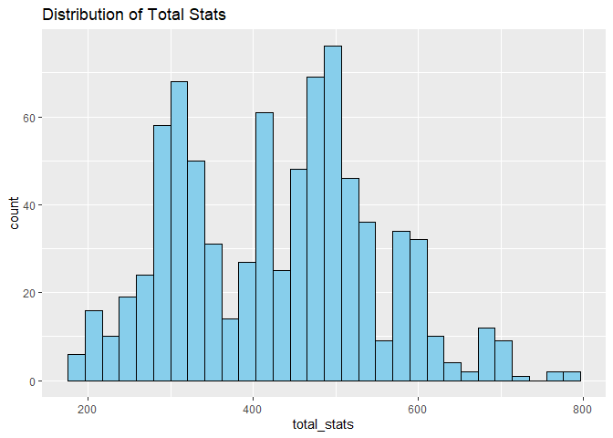
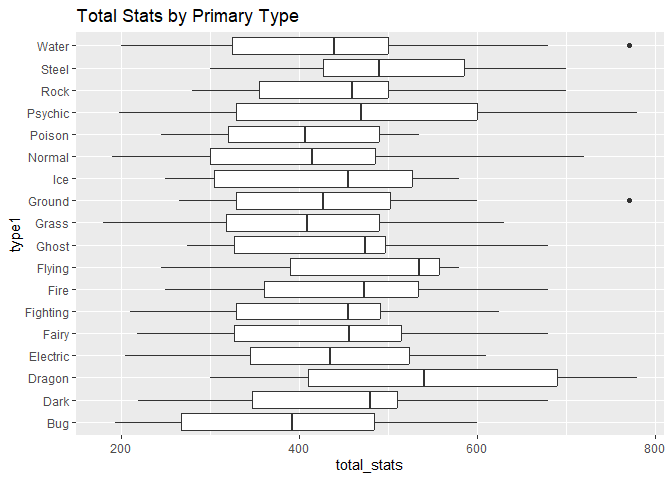
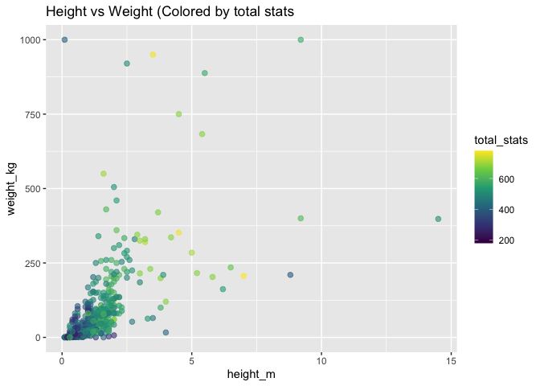

Serg’s Project Working File
================
Sergio Ozoria
2025-11-26

# 1. Preparing variables

``` r
library(tidyverse)
```

    ## ── Attaching core tidyverse packages ──────────────────────── tidyverse 2.0.0 ──
    ## ✔ dplyr     1.1.4     ✔ readr     2.1.5
    ## ✔ forcats   1.0.0     ✔ stringr   1.5.1
    ## ✔ ggplot2   3.5.2     ✔ tibble    3.3.0
    ## ✔ lubridate 1.9.4     ✔ tidyr     1.3.1
    ## ✔ purrr     1.0.4     
    ## ── Conflicts ────────────────────────────────────────── tidyverse_conflicts() ──
    ## ✖ dplyr::filter() masks stats::filter()
    ## ✖ dplyr::lag()    masks stats::lag()
    ## ℹ Use the conflicted package (<http://conflicted.r-lib.org/>) to force all conflicts to become errors

``` r
#  serg - cleaning up name using snake format + concatenating missing values 
poke_tidy = read_csv("./Data/pokemon.csv", na = c("NA", ".", "")) |> 
  janitor::clean_names()
```

    ## Rows: 801 Columns: 41
    ## ── Column specification ────────────────────────────────────────────────────────
    ## Delimiter: ","
    ## chr  (7): abilities, capture_rate, classfication, japanese_name, name, type1...
    ## dbl (34): against_bug, against_dark, against_dragon, against_electric, again...
    ## 
    ## ℹ Use `spec()` to retrieve the full column specification for this data.
    ## ℹ Specify the column types or set `show_col_types = FALSE` to quiet this message.

``` r
# serg - replacing missing type 2 with none
poke_tidy = poke_tidy |> 
  mutate(
    type2 = ifelse(is.na(type2), "None", type2),
    type1 = str_to_title(type1),
    type2 = str_to_title(type2)
  ) |> 
  distinct(name, .keep_all = TRUE)

# serg - cleaning up abilities (could also create variables for each)
poke_tidy = poke_tidy |> 
  mutate(
    abilities = str_remove_all(abilities, "\\[|\\]|'")
  )

# serg - in case there's missing gender 
poke_tidy = poke_tidy |> 
  mutate(
    genderless = ifelse(is.na(percentage_male), TRUE, FALSE)
  )

# serg - categorical var for plotting/modeling
poke_tidy = poke_tidy |> 
  mutate(
    type1 = factor(type1),
    type2 = factor(type2),
    generation = factor(generation),
    is_legendary = as.logical(is_legendary)
  )
```

``` r
# eman - convert  numeric columns

poke_tidy=
  poke_tidy |> 
  mutate(across(
    .cols = c(starts_with("against_"), "hp", "attack", "defense", "sp_attack", "sp_defense", "speed", "height_m", "weight_kg", "base_total"),
    .fns = as.numeric
  )) 
```

``` r
# eman - create total stats

poke_tidy =
  poke_tidy |> 
  mutate(total_stats = hp + attack +defense + sp_attack + sp_defense + speed )
```

``` r
# eman - create attack/defense ratio (useful for visuals later)

poke_tidy = 
  poke_tidy |> 
  mutate(offense_defense_ratio = attack / defense)
```

``` r
# eman - starting with basic eda

head(poke_tidy)
```

    ## # A tibble: 6 × 44
    ##   abilities             against_bug against_dark against_dragon against_electric
    ##   <chr>                       <dbl>        <dbl>          <dbl>            <dbl>
    ## 1 Overgrow, Chlorophyll        1               1              1              0.5
    ## 2 Overgrow, Chlorophyll        1               1              1              0.5
    ## 3 Overgrow, Chlorophyll        1               1              1              0.5
    ## 4 Blaze, Solar Power           0.5             1              1              1  
    ## 5 Blaze, Solar Power           0.5             1              1              1  
    ## 6 Blaze, Solar Power           0.25            1              1              2  
    ## # ℹ 39 more variables: against_fairy <dbl>, against_fight <dbl>,
    ## #   against_fire <dbl>, against_flying <dbl>, against_ghost <dbl>,
    ## #   against_grass <dbl>, against_ground <dbl>, against_ice <dbl>,
    ## #   against_normal <dbl>, against_poison <dbl>, against_psychic <dbl>,
    ## #   against_rock <dbl>, against_steel <dbl>, against_water <dbl>, attack <dbl>,
    ## #   base_egg_steps <dbl>, base_happiness <dbl>, base_total <dbl>,
    ## #   capture_rate <chr>, classfication <chr>, defense <dbl>, …

``` r
ggplot(poke_tidy, aes(total_stats))+
  geom_histogram(bins = 30, fill = "skyblue", color = "black")+
  labs(title = "Distribution of Total Stats")
```

<!-- -->

``` r
# eman - average total stats by type

ggplot(poke_tidy, aes(type1, total_stats))+
  geom_boxplot()+
  coord_flip()+
  labs(title = "Total Stats by Primary Type")
```

<!-- -->

``` r
#eman - height vs weight colored by strength

ggplot(poke_tidy, aes(height_m, weight_kg, color = total_stats))+
  geom_point(alpha = 0.6, size =2)+
  scale_color_viridis_c()+
  labs(title = "Height vs Weight (Colored by total stats")
```

    ## Warning: Removed 20 rows containing missing values or values outside the scale range
    ## (`geom_point()`).

<!-- -->

``` r
# eman - hypothesis testing
# test 1: ANOVA - Do types differ in strength?
# Null hypothesis: mean total stats are equal across all types

anova_type = 
  aov(total_stats ~ type1, data = poke_tidy)
summary(anova_type)
```

    ##              Df   Sum Sq Mean Sq F value   Pr(>F)    
    ## type1        17   749022   44060   3.249 1.04e-05 ***
    ## Residuals   783 10618573   13561                     
    ## ---
    ## Signif. codes:  0 '***' 0.001 '**' 0.01 '*' 0.05 '.' 0.1 ' ' 1

``` r
# eman - hypothesis testing
# test 2: t-test - Are legendary Pokemon stronger?
# Null hypothesis:legendary and non-legendary pokemon have the same mean total stats

t.test(total_stats ~ is_legendary, data = poke_tidy)
```

    ## 
    ##  Welch Two Sample t-test
    ## 
    ## data:  total_stats by is_legendary
    ## t = -19.268, df = 92.287, p-value < 2.2e-16
    ## alternative hypothesis: true difference in means between group FALSE and group TRUE is not equal to 0
    ## 95 percent confidence interval:
    ##  -225.8825 -183.6688
    ## sample estimates:
    ## mean in group FALSE  mean in group TRUE 
    ##            410.4815            615.2571

``` r
# eman - logistic regression (predicting legendary)

legend_model =
  glm (
    is_legendary ~ total_stats + type1+ generation,
    data = poke_tidy, 
    family = "binomial"
  )
```

    ## Warning: glm.fit: fitted probabilities numerically 0 or 1 occurred

``` r
summary(legend_model)
```

    ## 
    ## Call:
    ## glm(formula = is_legendary ~ total_stats + type1 + generation, 
    ##     family = "binomial", data = poke_tidy)
    ## 
    ## Coefficients:
    ##                 Estimate Std. Error z value Pr(>|z|)    
    ## (Intercept)   -2.239e+01  2.767e+00  -8.093 5.80e-16 ***
    ## total_stats    3.386e-02  4.245e-03   7.976 1.51e-15 ***
    ## type1Dark      2.736e-01  1.168e+00   0.234  0.81480    
    ## type1Dragon   -1.397e+00  1.141e+00  -1.224  0.22090    
    ## type1Electric  1.536e+00  1.029e+00   1.492  0.13558    
    ## type1Fairy    -2.487e-01  1.858e+00  -0.134  0.89348    
    ## type1Fighting -1.605e+01  1.541e+03  -0.010  0.99169    
    ## type1Fire      8.577e-01  9.762e-01   0.879  0.37959    
    ## type1Flying    2.076e+00  1.974e+00   1.052  0.29287    
    ## type1Ghost    -9.687e-01  1.696e+00  -0.571  0.56777    
    ## type1Grass     1.447e-01  9.941e-01   0.146  0.88430    
    ## type1Ground    1.941e-01  1.421e+00   0.137  0.89134    
    ## type1Ice       1.620e+00  1.154e+00   1.404  0.16046    
    ## type1Normal   -1.120e+00  1.130e+00  -0.991  0.32173    
    ## type1Poison   -1.449e+01  1.542e+03  -0.009  0.99250    
    ## type1Psychic   2.636e+00  9.705e-01   2.716  0.00661 ** 
    ## type1Rock      2.770e-01  1.100e+00   0.252  0.80121    
    ## type1Steel     1.142e+00  1.110e+00   1.029  0.30325    
    ## type1Water    -1.926e-01  9.945e-01  -0.194  0.84642    
    ## generation2    4.391e-01  9.427e-01   0.466  0.64134    
    ## generation3   -1.655e-03  8.533e-01  -0.002  0.99845    
    ## generation4    1.357e+00  7.983e-01   1.700  0.08918 .  
    ## generation5    2.057e+00  7.919e-01   2.598  0.00938 ** 
    ## generation6    8.270e-01  1.026e+00   0.806  0.42014    
    ## generation7    3.563e+00  8.468e-01   4.208 2.58e-05 ***
    ## ---
    ## Signif. codes:  0 '***' 0.001 '**' 0.01 '*' 0.05 '.' 0.1 ' ' 1
    ## 
    ## (Dispersion parameter for binomial family taken to be 1)
    ## 
    ##     Null deviance: 474.93  on 800  degrees of freedom
    ## Residual deviance: 177.25  on 776  degrees of freedom
    ## AIC: 227.25
    ## 
    ## Number of Fisher Scoring iterations: 18

``` r
poke_tidy$predicted_legendary =
  predict(legend_model, type = "response")
```

``` r
#eman - saving clean dataset

write_csv(poke_tidy, "Data/pokemon_clean.csv")
```
